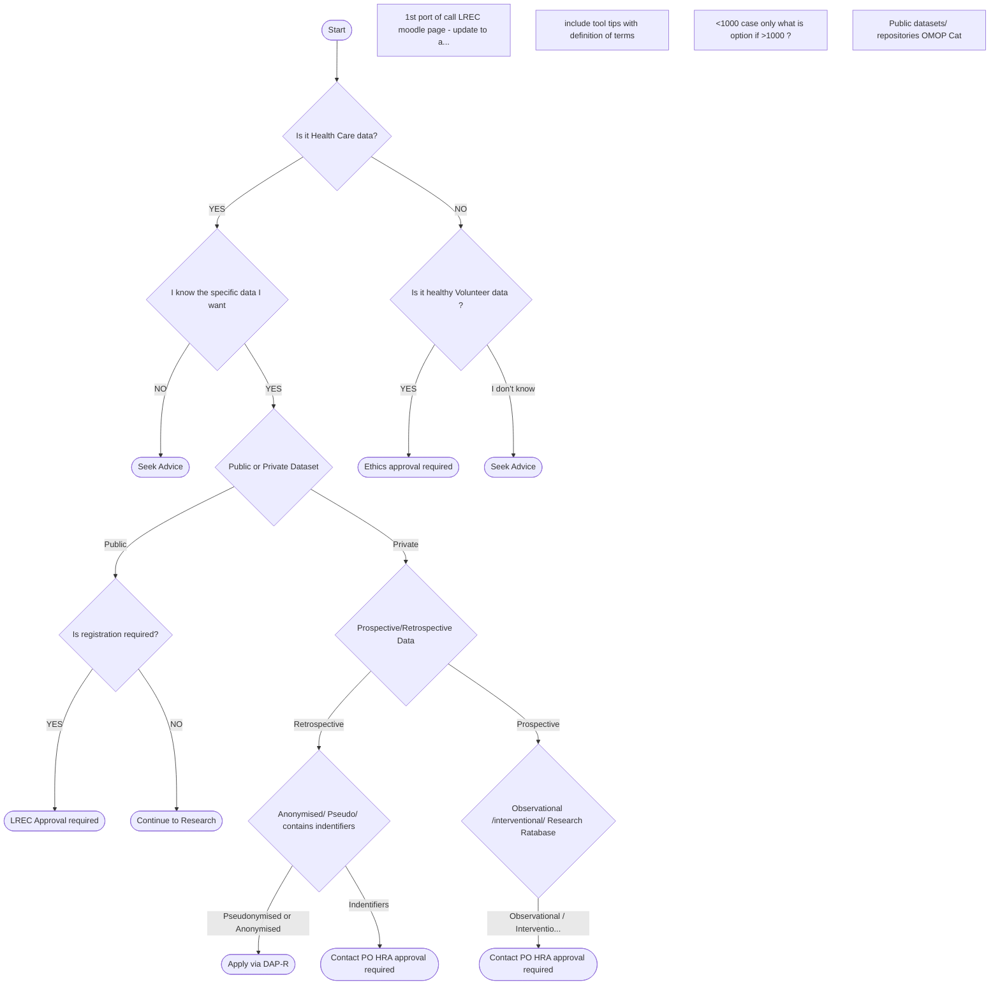

# Fixed Decision Tree Diagram

```mermaid
flowchart TD
    N3458764635301875090(["Start"])
    N3458764635301463439{"Is it Health Care data?"}
    N3458764635301463798{"Is it healthy Volunteer data ?"}
    N3458764635301699516{"I know the specific data I want"}
    N3458764635302567244{"Is registration required?"}
    N3458764635302888442(["Continue to Research"])
    N3458764635302990895{"Prospective/Retrospective Data"}
    N3458764635357760287{"Observational /interventional/ Research Ratabase"}
    N3458764635360322378["1st port of call LREC moodle page - update to a..."]
    N3458764635360532325["include tool tips with definition of terms"]
    N3458764635362755501{"Anonymised/ Pseudo/ contains indentifiers"}
    N3458764636358126539{"Public or Private Dataset"}
    N3458764636360976194["&lt;1000 case only what is option if &gt;1000 ?"]
    N3458764636474796545(["Apply via DAP-R"])
    N3458764636474951140(["Contact PO HRA approval required"])
    N3458764636474951421(["Contact PO HRA approval required"])
    N3458764636474951443(["Seek Advice"])
    N3458764636475175178(["Seek Advice"])
    N3458764636475175262(["LREC Approval required"])
    N3458764636475175411(["Ethics approval required"])
    N3458764636476313931["Public datasets/ repositories OMOP Cat"]

    N3458764635302567244 -->|"YES"| N3458764636475175262
    N3458764635302567244 -->|"NO"| N3458764635302888442
    N3458764635302990895 -->|"Retrospective"| N3458764635362755501
    N3458764636358126539 -->|"Public"| N3458764635302567244
    N3458764635302990895 -->|"Prospective"| N3458764635357760287
    N3458764635357760287 -->|"Observational / Interventio..."| N3458764636474951421
    N3458764635362755501 -->|"Pseudonymised or Anonymised"| N3458764636474796545
    N3458764635301463798 -->|"YES"| N3458764636475175411
    N3458764635301699516 -->|"NO"| N3458764636475175178
    N3458764635301875090 --> N3458764635301463439
    N3458764635301463439 -->|"YES"| N3458764635301699516
    N3458764635301699516 -->|"YES"| N3458764636358126539
    N3458764636358126539 -->|"Private"| N3458764635302990895
    N3458764635362755501 -->|"Indentifiers"| N3458764636474951140
    N3458764635301463439 -->|"NO"| N3458764635301463798
    N3458764635301463798 -->|"I don't know"| N3458764636474951443
```