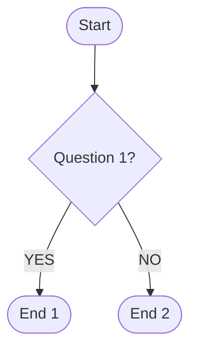

# Test Mermaid Diagram

```mermaid
flowchart TD
    Start(["Start"])
    Q1{"Question 1?"}
    End1(["End 1"])
    End2(["End 2"])
    
    Start --> Q1
    Q1 -->|"YES"| End1
    Q1 -->|"NO"| End2
```